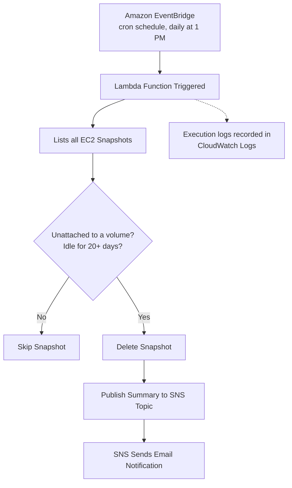

# EC2 Idle Snapshot Cleanup

**AWS Cost Optimization Project** — Automated detection & deletion of orphaned EBS snapshots using Lambda, EventBridge & SNS.

---

## Table of Contents
- [Problem Statement](#problem-statement)
- [Solution Overview](#solution-overview)
- [Architecture Flow](#architecture-flow)
- [Tech Stack](#tech-stack--services-used)
- [IAM Permissions](#iam-permissions)
- [Lambda Function Logic](#lambda-function-logic)
- [Issue Faced & Fix](#issue-faced--fix)
- [Estimated Monthly Cost Savings](#estimated-monthly-cost-savings)
- [Screenshots](#screenshots)
- [Testing & Validation](#testing--validation)
- [Outcome](#outcome)
- [Future Improvements](#future-improvements)

---

## Problem Statement

DevOps engineers create EBS snapshots of volumes when needed — backups, safety checkpoints, and the like — but often forget to delete them afterward. Over time, the original EC2 instance and volume may get deleted, but the snapshot stays behind, sitting idle and unattached to anything, quietly adding to the AWS bill.

## Solution Overview

A scheduled Lambda function automatically scans all EC2 snapshots every day, identifies the ones that are unattached to any volume and idle for 20+ days, deletes them, and sends an email summary — removing the need for manual cleanup.

## Architecture Flow

## Tech Stack / Services Used

| Service | Purpose |
|---|---|
| **AWS Lambda** | Runs the Python function that finds and deletes idle snapshots |
| **Amazon EventBridge** | Triggers Lambda automatically via a cron schedule, daily at 1 PM |
| **Amazon SNS** | Sends email notifications after each cleanup run |
| **Amazon EC2 (Snapshots & Volumes)** | The resources being scanned and cleaned up |
| **AWS IAM** | Grants Lambda the exact permissions it needs — least privilege |
| **Python (boto3)** | SDK used to write the Lambda function logic |
| **Amazon CloudWatch Logs** | Used to monitor execution and debug errors |
| **Claude** | Used to write the Lambda function's Python (boto3) code |

## IAM Permissions

The Lambda execution role follows the principle of least privilege — scoped only to the EC2, SNS, and CloudWatch Logs actions this function actually needs.

Full policy JSON: [`iam_policy.json`](./iam_policy.json)

## Lambda Function Logic

1. Fetch all EC2 snapshots owned by this account.
2. For each snapshot, skip it if it hasn't yet crossed the **20-day idle threshold**.
3. If the snapshot has no `VolumeId` at all, it's already orphaned — delete it.
4. Otherwise, look up the source volume: if it exists but has no attachments (i.e., not attached to any running instance), delete the snapshot.
5. If the source volume no longer exists at all (`InvalidVolume.NotFound`), the snapshot is orphaned — delete it.
6. Collect all deleted snapshot IDs, and publish a single summary message to the SNS topic once the scan is complete.
7. SNS forwards this as an email notification.

Full source: [`lambda_function.py`](./lambda_function.py)

## Issue Faced & Fix

> **⚠ Issue:** During testing, CloudWatch Logs showed an `InvalidParameterException` caused by an incorrect SNS Topic ARN.

> **✓ Fix:** Updating the Topic ARN resolved the issue, after which the notification flow worked as expected.

## Estimated Monthly Cost Savings

A rough, low-level estimate based on the current AWS EBS Standard-tier snapshot storage rate of **$0.05 per GB-month**:

| Usage Level | Idle Snapshots Cleaned / Month | Avg. Snapshot Size | Storage Cost Avoided / Month | ≈ INR / Month |
|---|---|---|---|---|
| Light | 5 | 8 GB | $2.00 | ≈ ₹166 |
| Medium | 15 | 12 GB | $9.00 | ≈ ₹747 |
| Heavy | 30 | 20 GB | $30.00 | ≈ ₹2,490 |

**Formula:** `Snapshots deleted/month × Avg. size (GB) × $0.05/GB-month`

Even a small team accumulating 5 forgotten snapshots a month saves a small but real amount — and it compounds every month those snapshots would otherwise sit unused. Exact figures for your account can be checked in Cost Explorer under usage type `EBS:SnapshotUsage`.

## Screenshots

> Replace these with your actual screenshots in the `screenshots/` folder. Redact account IDs and email addresses before uploading.

| Description | Screenshot |
|---|---|
| EventBridge trigger configuration | `screenshots/eventbridge_trigger.png` |
| Lambda function console | `screenshots/lambda_console.png` |
| CloudWatch Logs — successful run | `screenshots/cloudwatch_logs_success.png` |
| SNS email notification received | `screenshots/sns_email_notification.png` |

## Testing & Validation

To validate the function before relying on the daily schedule:
1. Manually created a throwaway EBS snapshot, detached from any volume.
2. Waited past the 20-day idle threshold (or temporarily lowered `IDLE_THRESHOLD_DAYS` for a quick test).
3. Manually invoked the Lambda function and confirmed the snapshot was deleted.
4. Verified the email notification arrived with the correct snapshot ID.
5. Checked CloudWatch Logs to confirm no errors were thrown during the run.

## Outcome

- Idle, unattached EBS snapshots older than 20 days are automatically detected and deleted daily.
- Reduces unnecessary storage costs from forgotten snapshots.
- An email notification containing the IDs of all deleted snapshots is sent after each successful cleanup.
- On failure, CloudWatch Logs provide the error trail for quick debugging.

## Future Improvements

- Move from console-based setup to **Terraform** for repeatable, version-controlled infrastructure.
- Use **SNS message filtering / formatting** for cleaner, more readable email notifications instead of raw text.
- Add **tag-based exclusion** (e.g. `DoNotDelete=true`) so critical snapshots are never auto-deleted regardless of age.
- Extend to **Amazon Data Lifecycle Manager (DLM)** policies for organization-wide snapshot retention rules.
- Add a **dry-run mode** (log what *would* be deleted without deleting) for safer testing in production accounts.
