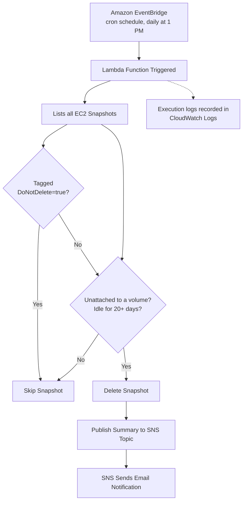

# EC2 Idle Snapshot Cleanup

**AWS Cost Optimization Project** — Automated, tag-aware detection & deletion of orphaned EBS snapshots using Lambda, EventBridge & SNS.

---

## Table of Contents
- [Problem Statement](#problem-statement)
- [Solution Overview](#solution-overview)
- How to deploy
- [Architecture Flow](#architecture-flow)
- [Tech Stack](#tech-stack--services-used)
- [IAM Permissions](#iam-permissions)
- [Lambda Function Logic](#lambda-function-logic)
- [Issue Faced & Fix](#issue-faced--fix)
- [Estimated Monthly Cost Savings](#estimated-monthly-cost-savings)
- [Testing & Validation](#testing--validation)
- [Outcome](#outcome)

---

## Problem Statement

DevOps engineers create EBS snapshots of volumes when needed — backups, safety checkpoints, and the like — but often forget to delete them afterward. Over time, the original EC2 instance and volume may get deleted, but the snapshot stays behind, sitting idle and unattached to anything, quietly adding to the AWS bill.

## Solution Overview

Instead of relying on manual tracking, the entire process is automated end-to-end using a scheduled serverless function. The solution is built around four core ideas:

1. **Fully automated, no manual trigger needed** — An EventBridge cron rule invokes the Lambda function daily, so no one has to remember to run a cleanup script.

2. **Safe, criteria-based deletion** — A snapshot is deleted only if it's orphaned (never attached to a volume, source volume deleted, or volume exists but unattached). Snapshots explicitly tagged `DoNotDelete=true` are always skipped, giving engineers a manual override for exceptions.

3. **Time-based safety buffer** — Snapshots younger than 20 days are always skipped, even if orphaned, giving a grace period before permanent deletion.

4. **Visibility after every run** — A consolidated email via SNS lists exactly which snapshots were deleted, with full execution details in CloudWatch Logs for debugging.

**The result:** forgotten snapshots stop quietly accumulating storage cost, without any ongoing manual effort.

## How to Deploy

1. **Create the SNS topic** — go to SNS → Create topic → Standard → give it a name (e.g. `snapshots`) → create an email subscription and confirm it via the link AWS sends you.
2. **Create the Lambda function** — Runtime: Python 3.12+, paste in [lambda_function_by_claudecode.py](./lambda_function_by_claudecode.py)
3. Before deploying, edit TOPIC_ARN and IDLE_THRESHOLD_DAYS directly in the script to match your setup.
   - `TOPIC_ARN` → your SNS topic ARN
   - `IDLE_THRESHOLD_DAYS` → `20` (or your preferred threshold)
4. **Attach the IAM policy** — apply [`iam_policy.json`](./iam_policy.json) to the Lambda's execution role (replace `YOUR_ACCOUNT_ID` with your actual AWS account ID).
5. **Create the EventBridge trigger** — Add trigger → EventBridge (CloudWatch Events) → create a new rule with a cron schedule (e.g. `cron(30 7 * * ? *)` for daily 1 PM IST) → attach it to the Lambda.
6. **Test manually** — invoke the Lambda with a test event to confirm the flow works before relying on the schedule.
## Architecture Flow

## Tech Stack / Services Used

| Service | Purpose |
|---|---|
| **AWS Lambda** | Runs the Python function that finds and deletes idle snapshots |
| **Amazon EventBridge** | Triggers Lambda automatically via a cron schedule, daily at 1 PM |
| **Amazon SNS** | Sends email notifications after each cleanup run |
| **Amazon EC2 (Snapshots & Volumes)** | The resources being scanned and cleaned up |
| **AWS IAM** | Grants Lambda the exact permissions it needs — least privilege |
| **Python (boto3)** | SDK used to write the Lambda function logic — code written by Claude, tested and debugged by me |
| **Amazon CloudWatch Logs** | Used to monitor execution and debug errors |

## IAM Permissions

The Lambda execution role follows the principle of least privilege — scoped only to the exact actions this function needs, nothing broader.

| Permission | What it does | Why it's needed |
|---|---|---|
| `ec2:DescribeInstances` | Lists EC2 instances and their running state | Used to identify currently running instances |
| `ec2:DescribeVolumes` | Lists EBS volumes and their attachment status | Checks whether a snapshot's source volume still exists and is attached |
| `ec2:DescribeSnapshots` | Lists all EBS snapshots in the account | Needed to scan every snapshot during each run |
| `ec2:DeleteSnapshot` | Deletes a specific snapshot | Performs the actual cleanup once a snapshot is confirmed orphaned |
| `sns:Publish` | Publishes a message to a specific SNS topic | Sends the cleanup summary email — scoped to one topic ARN, not all of SNS |
| `logs:CreateLogGroup`, `logs:CreateLogStream`, `logs:PutLogEvents` | Creates and writes to CloudWatch Log groups/streams | Without this, the function still runs, but no execution logs would be visible for debugging |

Full policy JSON:  [iam_policy.json](./iam_policy.json)

## Lambda Function Logic

1. Fetch all EC2 snapshots owned by this account.
2. For each snapshot, check for a `DoNotDelete=true` tag — if present, skip it unconditionally, regardless of age or orphan status.
3. For each snapshot, skip it if it hasn't yet crossed the **20-day idle threshold**.
4. If the snapshot has no `VolumeId` at all, it's already orphaned — delete it.
5. Otherwise, look up the source volume: if it exists but has no attachments (i.e., not attached to any running instance), delete the snapshot.
6. If the source volume no longer exists at all (`InvalidVolume.NotFound`), the snapshot is orphaned — delete it.
7. Collect all deleted snapshot IDs, and publish a single summary message to the SNS topic once the scan is complete.
8. SNS forwards this as an email notification.

Full source: [lambda_function_by_claudecode.py](./lambda_function_by_claudecode.py)
## Issue Faced & Fix

> **⚠ Issue:** During testing, CloudWatch Logs showed an `InvalidParameterException` caused by an incorrect SNS Topic ARN.

> **✓ Fix:** Updating the Topic ARN resolved the issue, after which the notification flow worked as expected.

## Estimated Monthly Cost Savings

A rough, low-level estimate based on the current AWS EBS Standard-tier snapshot storage rate of **$0.05 per GB-month**:

| Usage Level | Idle Snapshots Cleaned / Month | Avg. Snapshot Size | Storage Cost Avoided / Month | ≈ INR / Month |
|---|---|---|---|---|
| Light | 5 | 8 GB | $2.00 | ≈ ₹166 |
| Medium | 15 | 12 GB | $9.00 | ≈ ₹747 |
| Heavy | 30 | 20 GB | $30.00 | ≈ ₹2,490 |

**Formula:** `Snapshots deleted/month × Avg. size (GB) × $0.05/GB-month`

Even a small team accumulating 5 forgotten snapshots a month saves a small but real amount — and it compounds every month those snapshots would otherwise sit unused. Exact figures for your account can be checked in Cost Explorer under usage type `EBS:SnapshotUsage`.

## Testing & Validation

To validate the function before relying on the daily schedule:
1. Manually created a throwaway EBS snapshot, detached from any volume.
2. Waited past the 20-day idle threshold (or temporarily lowered `IDLE_THRESHOLD_DAYS` for a quick test).
3. Manually invoked the Lambda function and confirmed the snapshot was deleted.
4. Verified the email notification arrived with the correct snapshot ID.
5. Checked CloudWatch Logs to confirm no errors were thrown during the run.

## Outcome

- Idle, unattached EBS snapshots older than 20 days are automatically detected and deleted daily.
- Reduces unnecessary storage costs from forgotten snapshots.
- An email notification containing the IDs of all deleted snapshots is sent after each successful cleanup.
- On failure, CloudWatch Logs provide the error trail for quick debugging.
